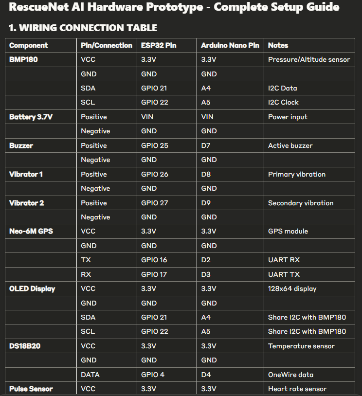

# RescueNet AI - Emergency Response System

A comprehensive IoT-based emergency response system that monitors health vitals in real-time and automatically alerts emergency services when anomalies are detected.

## 🚀 Features

- **Real-time Health Monitoring**: Continuous monitoring of heart rate, body temperature, and blood pressure
- **Fall Detection**: Advanced accelerometer-based fall detection using ESP32
- **Emergency SMS Alerts**: Direct SMS notifications via SIM800L GSM module
- **Emergency Notifications**: Email notifications to emergency contacts
- **Live Dashboard**: Web-based dashboard with real-time vital signs visualization
- **WebSocket Integration**: Real-time data streaming for instant updates
- **Mobile Responsive**: Works on all devices (desktop, tablet, mobile)
- **Data Analytics**: Health trend analysis and pattern detection
- **Emergency History**: Complete log of all emergency incidents
- **Cellular Backup**: SIM800L provides connectivity when WiFi is unavailable

## 🛠️ Technology Stack

### Backend
- **Node.js** with Express.js
- **MongoDB** for data storage
- **WebSocket** for real-time communication
- **SMS Integration** via SIM800L or Twilio
- **Nodemailer** for email alerts

### Frontend
- **HTML5/CSS3/JavaScript**
- **Chart.js** for data visualization
- **Leaflet.js** for mapping
- **WebSocket** for real-time updates

### Hardware (ESP32)
- **ESP32** development board
- **MAX30102** heart rate & SpO2 sensor
- **DS18B20** temperature sensor
- **MPU6050** accelerometer/gyroscope
- **SIM800L** GSM module for SMS alerts
- **OLED Display** for local status
- **GPS Module** for location tracking

## 📊 Circuit Diagrams

### 🎨 Color Legend

<table>
<tr>
<td style="background-color:#e74c3c; color:white; width:30px;"></td>
<td><span style="color:#e74c3c">■</span> Controller & Emergency Indicators</td>
</tr>
<tr>
<td style="background-color:#3498db; color:white;"></td>
<td><span style="color:#3498db">■</span> Heart Rate & Emergency Controls</td>
</tr>
<tr>
<td style="background-color:#f39c12; color:white;"></td>
<td><span style="color:#f39c12">■</span> Temperature & Audio Feedback</td>
</tr>
<tr>
<td style="background-color:#2ecc71; color:white;"></td>
<td><span style="color:#2ecc71">■</span> Motion Detection & Status</td>
</tr>
<tr>
<td style="background-color:#9b59b6; color:white;"></td>
<td><span style="color:#9b59b6">■</span> Communication Components</td>
</tr>
<tr>
<td style="background-color:#34495e; color:white;"></td>
<td><span style="color:#34495e">■</span> Display & Interface Components</td>
</tr>
</table>

<div align="center">

</div>

### 🔌 Main Components

<table>
<tr>
<th>Component</th>
<th>Description</th>
<th>Connection</th>
</tr>
<tr>
<td><span style="color:#e74c3c">📟 ESP32</span></td>
<td>Main microcontroller</td>
<td>Central processing unit</td>
</tr>
<tr>
<td><span style="color:#3498db">❤️ MAX30102</span></td>
<td>Heart Rate & SpO2 Sensor</td>
<td>I2C (SDA: GPIO21, SCL: GPIO22)</td>
</tr>
<tr>
<td><span style="color:#f39c12">🌡️ DS18B20</span></td>
<td>Temperature Sensor</td>
<td>1-Wire (Data: GPIO4)</td>
</tr>
<tr>
<td><span style="color:#9b59b6">📱 SIM800L</span></td>
<td>GSM Module</td>
<td>UART (RX: GPIO16, TX: GPIO17)</td>
</tr>
<tr>
<td><span style="color:#2ecc71">📊 MPU6050</span></td>
<td>Accelerometer/Gyroscope</td>
<td>I2C (SDA: GPIO21, SCL: GPIO22)</td>
</tr>
<tr>
<td><span style="color:#34495e">📺 SSD1306</span></td>
<td>OLED Display</td>
<td>I2C (SDA: GPIO21, SCL: GPIO22)</td>
</tr>
</table>

### 🔄 Arduino Nano Alternative

<div align="center">

</div>

<table>
<tr>
<th>Component</th>
<th>Arduino Nano Pin</th>
<th>Function</th>
</tr>
<tr>
<td><span style="color:#3498db">❤️ MAX30102</span></td>
<td>I2C (A4, A5)</td>
<td>Heart Rate & SpO2 Sensor</td>
</tr>
<tr>
<td><span style="color:#f39c12">🌡️ DS18B20</span></td>
<td>D3</td>
<td>Temperature Sensor with 4.7kΩ pullup</td>
</tr>
<tr>
<td><span style="color:#2ecc71">📊 MPU6050</span></td>
<td>I2C (A4, A5)</td>
<td>Accelerometer/Gyroscope for fall detection</td>
</tr>
<tr>
<td><span style="color:#34495e">📺 SSD1306</span></td>
<td>I2C (A4, A5)</td>
<td>OLED Display for local status</td>
</tr>
<tr>
<td><span style="color:#2ecc71">🟢 Status LED</span></td>
<td>D4</td>
<td>System status indicator</td>
</tr>
<tr>
<td><span style="color:#e74c3c">🔴 Emergency LED</span></td>
<td>D6</td>
<td>Emergency status indicator</td>
</tr>
<tr>
<td><span style="color:#3498db">🔵 Emergency Button</span></td>
<td>D2</td>
<td>Manual emergency trigger</td>
</tr>
<tr>
<td><span style="color:#f39c12">🔊 Buzzer</span></td>
<td>D5</td>
<td>Audio alert output</td>
</tr>
</table>

### 🚨 Indicators & Controls

<table>
<tr>
<th>Component</th>
<th>ESP32 Pin</th>
<th>Function</th>
</tr>
<tr>
<td><span style="color:#2ecc71">🟢 Status LED</span></td>
<td>GPIO 5</td>
<td>System status indicator</td>
</tr>
<tr>
<td><span style="color:#e74c3c">🔴 Emergency LED</span></td>
<td>GPIO 18</td>
<td>Emergency status indicator</td>
</tr>
<tr>
<td><span style="color:#3498db">🔵 Emergency Button</span></td>
<td>GPIO 0</td>
<td>Manual emergency trigger</td>
</tr>
<tr>
<td><span style="color:#f39c12">🔊 Buzzer</span></td>
<td>GPIO 2</td>
<td>Audio alert output</td>
</tr>
</table>

### 📐 Connection Diagram (Interactive ASCII Representation)

<pre style="line-height:1.2em">
<span style="color:#e74c3c">┏━━━━━━━━━━┓</span>       <span style="color:#3498db">┏━━━━━━━━━━━┓</span>       <span style="color:#f39c12">┏━━━━━━━━━━┓</span>
<span style="color:#e74c3c">┃   ESP32   ┃</span>───────<span style="color:#3498db">┃  MAX30102  ┃</span>       <span style="color:#f39c12">┃  DS18B20  ┃</span>
<span style="color:#e74c3c">┃           ┃</span>       <span style="color:#3498db">┃ Heart Rate ┃</span>       <span style="color:#f39c12">┃   Temp    ┃</span>
<span style="color:#e74c3c">┗━┯━━━━━┯━━━┛</span>       <span style="color:#3498db">┗━━━━┯━━━━━━┛</span>       <span style="color:#f39c12">┗━━━━┯━━━━━┛</span>
  <span style="color:#e74c3c">│</span>     <span style="color:#e74c3c">│</span>              <span style="color:#3498db">│</span>                <span style="color:#f39c12">│</span>
  <span style="color:#e74c3c">│</span>     <span style="color:#e74c3c">│</span>              <span style="color:#3498db">│</span>                <span style="color:#f39c12">│</span>
  <span style="color:#e74c3c">│</span>     <span style="color:#e74c3c">│</span>              <span style="color:#3498db">└────────┐</span>        <span style="color:#f39c12">│</span>
  <span style="color:#e74c3c">│</span>     <span style="color:#e74c3c">│</span>  <span style="color:#9b59b6">┏━━━━━━━━━━┓</span>      <span style="color:#3498db">│</span>        <span style="color:#f39c12">│</span>
  <span style="color:#e74c3c">│</span>     <span style="color:#e74c3c">└──┨</span><span style="color:#9b59b6">  SIM800L  ┃</span>      <span style="color:#3498db">│</span>        <span style="color:#f39c12">│</span>
  <span style="color:#e74c3c">│</span>        <span style="color:#9b59b6">┃    GSM    ┃</span>      <span style="color:#3498db">│</span>        <span style="color:#f39c12">│</span>
  <span style="color:#e74c3c">│</span>        <span style="color:#9b59b6">┗━━━━━━━━━━┛</span>      <span style="color:#3498db">│</span>        <span style="color:#f39c12">│</span>
  <span style="color:#e74c3c">│</span>                           <span style="color:#3498db">│</span>        <span style="color:#f39c12">│</span>
  <span style="color:#e74c3c">│</span>                           <span style="color:#3498db">│</span>        <span style="color:#f39c12">│</span>
  <span style="color:#e74c3c">│</span>                           <span style="color:#3498db">│</span>        <span style="color:#f39c12">│</span>
  <span style="color:#e74c3c">│</span>  <span style="color:#2ecc71">┏━━━━━━━━━━┓</span>            <span style="color:#3498db">│</span>        <span style="color:#f39c12">│</span>
  <span style="color:#e74c3c">└──┨</span><span style="color:#2ecc71">  MPU6050  ┠────────────┘</span>        <span style="color:#f39c12">│</span>
     <span style="color:#2ecc71">┃Accel/Gyro┃</span>                     <span style="color:#f39c12">│</span>
     <span style="color:#2ecc71">┗━━━━━━━━━━┛</span>                     <span style="color:#f39c12">│</span>
                                       <span style="color:#f39c12">│</span>
                                       <span style="color:#f39c12">│</span>
  <span style="color:#34495e">┏━━━━━━━━━━┓</span>                      <span style="color:#f39c12">│</span>
  <span style="color:#34495e">┃  SSD1306  ┠──────────────────────┘</span>
  <span style="color:#34495e">┃   OLED    ┃</span>
  <span style="color:#34495e">┗━━━━━━━━━━┛</span>

<span style="color:#e74c3c">ESP32</span> ─── <span style="color:#e74c3c">●</span> GPIO 0 ─── <span style="color:#3498db">🔵 Emergency Button</span>
      ─── <span style="color:#e74c3c">●</span> GPIO 2 ─── <span style="color:#f39c12">🔊 Buzzer</span>
      ─── <span style="color:#e74c3c">●</span> GPIO 4 ─── <span style="color:#f39c12">🌡️ DS18B20 Data</span>
      ─── <span style="color:#e74c3c">●</span> GPIO 5 ─── <span style="color:#2ecc71">🟢 Status LED</span>
      ─── <span style="color:#e74c3c">●</span> GPIO 18 ─── <span style="color:#e74c3c">🔴 Emergency LED</span>
      ─── <span style="color:#e74c3c">●</span> GPIO 21 ─── <span style="color:#34495e">📊 I2C SDA</span> (MAX30102, MPU6050, OLED)
      ─── <span style="color:#e74c3c">●</span> GPIO 22 ─── <span style="color:#34495e">📊 I2C SCL</span> (MAX30102, MPU6050, OLED)
</pre>

> For interactive circuit diagrams, visit the [web dashboard](#-usage) and navigate to the Circuit Diagrams section

## 📋 Prerequisites

- Node.js (v14 or higher)
- MongoDB (local or cloud)
- Arduino IDE (for ESP32 programming)
- **Active SIM card** with SMS plan (for SIM800L)
- Twilio account (optional, alternative to SIM800L)
- Gmail account (for emails)

## 🔧 Installation

### 1. Clone the Repository
```bash
git clone https://github.com/yourusername/rescuenet-ai.git
cd rescuenet-ai
```

### 2. Install Dependencies
```bash
npm install
```

### 3. Environment Configuration
Copy `.env.example` to `.env` and configure your settings:
```bash
cp .env.example .env
```

Edit `.env` with your configuration:
```env
# Database
MONGODB_URI=mongodb://localhost:27017/rescuenet

# Server
PORT=3000
WEBSOCKET_PORT=8080

# Twilio (SMS notifications)
TWILIO_ACCOUNT_SID=your_account_sid
TWILIO_AUTH_TOKEN=your_auth_token
TWILIO_PHONE_NUMBER=your_twilio_number

# Email notifications
EMAIL_USER=your_email@gmail.com
EMAIL_PASS=your_app_password
```

### 4. Start MongoDB
```bash
# Windows
net start MongoDB

# macOS/Linux
sudo systemctl start mongod
```

### 5. Run the Application
```bash
# Development mode
npm run dev

# Production mode
npm start
```

### 6. Access the Dashboard
Open your browser and go to: `http://localhost:3000`

## 🔌 ESP32 Setup

### Hardware Connections

<table>
  <tr>
    <th><span style="color:#e74c3c">ESP32 Pin</span></th>
    <th>Component</th>
    <th>Description</th>
  </tr>
  <tr>
    <td><span style="color:#e74c3c">GPIO 4</span></td>
    <td><span style="color:#f39c12">🌡️ DS18B20</span></td>
    <td>Temperature Sensor Data (1-Wire)</td>
  </tr>
  <tr>
    <td><span style="color:#e74c3c">GPIO 21</span></td>
    <td><span style="color:#34495e">📊 I2C SDA</span></td>
    <td>Shared I2C Data (MAX30102, MPU6050, OLED)</td>
  </tr>
  <tr>
    <td><span style="color:#e74c3c">GPIO 22</span></td>
    <td><span style="color:#34495e">📊 I2C SCL</span></td>
    <td>Shared I2C Clock (MAX30102, MPU6050, OLED)</td>
  </tr>
  <tr>
    <td><span style="color:#e74c3c">GPIO 2</span></td>
    <td><span style="color:#f39c12">🔊 Buzzer</span></td>
    <td>Audio Alert Output</td>
  </tr>
  <tr>
    <td><span style="color:#e74c3c">GPIO 5</span></td>
    <td><span style="color:#2ecc71">🟢 Status LED</span></td>
    <td>System Status Indicator</td>
  </tr>
  <tr>
    <td><span style="color:#e74c3c">GPIO 18</span></td>
    <td><span style="color:#e74c3c">🔴 Emergency LED</span></td>
    <td>Emergency Status Indicator</td>
  </tr>
  <tr>
    <td><span style="color:#e74c3c">GPIO 0</span></td>
    <td><span style="color:#3498db">🔵 Emergency Button</span></td>
    <td>Manual Emergency Trigger</td>
  </tr>
  <tr>
    <td><span style="color:#e74c3c">GPIO 16</span></td>
    <td><span style="color:#9b59b6">📱 SIM800L RXD</span></td>
    <td>Serial Receive from GSM Module</td>
  </tr>
  <tr>
    <td><span style="color:#e74c3c">GPIO 17</span></td>
    <td><span style="color:#9b59b6">📱 SIM800L TXD</span></td>
    <td>Serial Transmit to GSM Module</td>
  </tr>
</table>

### Arduino Libraries Required
Install these libraries through Arduino IDE Library Manager:
- WiFi (ESP32 built-in)
- ArduinoJson
- WebSocketsClient
- OneWire
- DallasTemperature
- MPU6050
- MAX30105
- SSD1306Wire
- HTTPClient

### Programming the ESP32
1. Open `esp32_enhanced.ino` in Arduino IDE
2. Update WiFi credentials and server IP
3. Update user ID (phone number)
4. Upload to ESP32

## 📱 Usage

### User Registration
1. Open the dashboard
2. Click "Register here"
3. Fill in personal and medical information
4. Complete registration

### Health Monitoring
1. Login with your phone number
2. The system automatically starts monitoring
3. View real-time vitals on the dashboard
4. Check health trends and statistics

### Emergency Features
- **Manual Emergency**: Press the red emergency button
- **Automatic Detection**: System automatically detects anomalies
- **Fall Detection**: ESP32 detects sudden falls
- **Instant Alerts**: SMS and email sent to emergency contacts

## 🚨 Emergency Thresholds

The system triggers emergency alerts when:
- Heart Rate: < 50 BPM or > 120 BPM
- Body Temperature: < 35°C or > 38.5°C
- Fall Detection: Sudden acceleration > 15g
- Manual Emergency: Emergency button pressed

## 📊 Dashboard Features

### Real-time Monitoring
- Live vital signs display
- Current location on map
- Connection status indicators
- Last update timestamps

### Health Analytics
- Historical data charts
- Trend analysis
- Weekly statistics
- Pattern detection

### Emergency Management
- Emergency history log
- Response tracking
- Contact management
- Status updates

## 🔧 API Endpoints

### User Management
- `POST /api/register` - Register new user
- `GET /api/user/:phone` - Get user details

### Health Data
- `POST /api/health-data` - Submit health data
- `GET /api/health-history/:userId` - Get health history
- `GET /api/dashboard/:userId` - Get dashboard data

### Emergency
- `POST /api/emergency` - Trigger emergency
- `GET /api/emergency-history/:userId` - Get emergency history

## 🛡️ Security Features

- Rate limiting on API endpoints
- Input validation and sanitization
- Secure headers with Helmet.js
- Environment-based configuration
- Error handling and logging

## 🔄 WebSocket Events

### Client to Server
- `subscribe` - Subscribe to user-specific updates

### Server to Client
- `health_data` - Real-time health data updates
- `emergency` - Emergency alert notifications
- `health_alert` - Health warnings

## 📈 Monitoring & Analytics

The system provides comprehensive analytics including:
- Health trend analysis
- Daily/weekly patterns
- Anomaly detection
- Statistical insights
- Personalized recommendations

## 🚑 Emergency Response Workflow

1. **Detection**: System detects anomaly or manual trigger
2. **Validation**: Confirms emergency conditions
3. **Notification**: Sends alerts to emergency contacts
4. **Location**: Shares precise location coordinates
5. **Medical Info**: Provides complete medical profile
6. **Tracking**: Monitors response and resolution

## 🔧 Troubleshooting

### Common Issues

**ESP32 not connecting to WiFi**
- Check WiFi credentials
- Ensure ESP32 is in range
- Verify network allows IoT devices

**No data on dashboard**
- Check MongoDB connection
- Verify ESP32 is sending data
- Check server logs for errors

**Emergency alerts not sent**
- Verify Twilio configuration
- Check email settings
- Ensure emergency contacts are valid

### Debug Mode
Enable debug logging by setting `NODE_ENV=development` in `.env`

## 🤝 Contributing

1. Fork the repository
2. Create a feature branch
3. Make your changes
4. Add tests if applicable
5. Submit a pull request

## 📄 License

This project is licensed under the MIT License - see the [LICENSE](LICENSE) file for details.

## 📞 Support

For support or questions:
- Create an issue on GitHub
- Email: support@rescuenet.ai
- Documentation: [Wiki](https://github.com/yourusername/rescuenet-ai/wiki)

## 🔮 Future Enhancements

- Machine learning for predictive health analytics
- Integration with hospital management systems
- Mobile app for iOS and Android
- Multi-language support
- Advanced sensor integration (ECG, glucose, etc.)
- Blockchain for secure health data storage

## 🙏 Acknowledgments
- hIIIIIIIIIiii
- ESP32 community for hardware support
- Node.js and MongoDB teams
- Chart.js and Leaflet.js contributors
- Medical professionals for guidance
- Open source community

---

**⚠️ Medical Disclaimer**: This system is for monitoring purposes only and should not replace professional medical advice, diagnosis, or treatment. Always consult healthcare professionals for medical concerns.

# Project Overview

RescueNet AI is an advanced emergency response system leveraging IoT technology to monitor health vitals and detect emergencies in real-time. The system is designed to provide immediate alerts and detailed health information to emergency services, ensuring timely and effective response.

## Table of Contents
- [Features](#-features)
- [Technology Stack](#-technology-stack)
- [Circuit Diagram](#circuit-diagram)
- [Connections](#connections)
- [Installation](#-installation)
- [ESP32 Setup](#-esp32-setup)
- [Usage](#-usage)
- [Emergency Thresholds](#-emergency-thresholds)
- [Dashboard Features](#-dashboard-features)
- [API Endpoints](#-api-endpoints)
- [Security Features](#-security-features)
- [WebSocket Events](#-websocket-events)
- [Monitoring & Analytics](#-monitoring--analytics)
- [Emergency Response Workflow](#-emergency-response-workflow)
- [Troubleshooting](#-troubleshooting)
- [Contributing](#-contributing)
- [License](#-license)
- [Support](#-support)
- [Future Enhancements](#-future-enhancements)
- [Acknowledgments](#-acknowledgments)

## Circuit Diagram


## Connections
- Sensor VCC → 5V supply
- Sensor GND → Ground
- Sensor Data → Pin D2
- MAX30102 SDA → GPIO 21
- MAX30102 SCL → GPIO 22
- MPU6050 SDA → GPIO 21
- MPU6050 SCL → GPIO 22
- SIM800L RXD → GPIO 16
- SIM800L TXD → GPIO 17
- OLED SDA → GPIO 21
- OLED SCL → GPIO 22
- Status LED → GPIO 5
- Emergency LED → GPIO 18
- Emergency Button → GPIO 0
- Buzzer → GPIO 2

For detailed connections, refer to the [Connections](#connections) section.

## Installation

### 1. Clone the Repository
```bash
git clone https://github.com/yourusername/rescuenet-ai.git
cd rescuenet-ai
```

### 2. Install Dependencies
```bash
npm install
```

### 3. Environment Configuration
Copy `.env.example` to `.env` and configure your settings:
```bash
cp .env.example .env
```

Edit `.env` with your configuration:
```env
# Database
MONGODB_URI=mongodb://localhost:27017/rescuenet

# Server
PORT=3000
WEBSOCKET_PORT=8080

# Twilio (SMS notifications)
TWILIO_ACCOUNT_SID=your_account_sid
TWILIO_AUTH_TOKEN=your_auth_token
TWILIO_PHONE_NUMBER=your_twilio_number

# Email notifications
EMAIL_USER=your_email@gmail.com
EMAIL_PASS=your_app_password
```

### 4. Start MongoDB
```bash
# Windows
net start MongoDB

# macOS/Linux
sudo systemctl start mongod
```

### 5. Run the Application
```bash
# Development mode
npm run dev

# Production mode
npm start
```

### 6. Access the Dashboard
Open your browser and go to: `http://localhost:3000`

## ESP32 Setup

### Hardware Connections

<table>
  <tr>
    <th><span style="color:#e74c3c">ESP32 Pin</span></th>
    <th>Component</th>
    <th>Description</th>
  </tr>
  <tr>
    <td><span style="color:#e74c3c">GPIO 4</span></td>
    <td><span style="color:#f39c12">🌡️ DS18B20</span></td>
    <td>Temperature Sensor Data (1-Wire)</td>
  </tr>
  <tr>
    <td><span style="color:#e74c3c">GPIO 21</span></td>
    <td><span style="color:#34495e">📊 I2C SDA</span></td>
    <td>Shared I2C Data (MAX30102, MPU6050, OLED)</td>
  </tr>
  <tr>
    <td><span style="color:#e74c3c">GPIO 22</span></td>
    <td><span style="color:#34495e">📊 I2C SCL</span></td>
    <td>Shared I2C Clock (MAX30102, MPU6050, OLED)</td>
  </tr>
  <tr>
    <td><span style="color:#e74c3c">GPIO 2</span></td>
    <td><span style="color:#f39c12">🔊 Buzzer</span></td>
    <td>Audio Alert Output</td>
  </tr>
  <tr>
    <td><span style="color:#e74c3c">GPIO 5</span></td>
    <td><span style="color:#2ecc71">🟢 Status LED</span></td>
    <td>System Status Indicator</td>
  </tr>
  <tr>
    <td><span style="color:#e74c3c">GPIO 18</span></td>
    <td><span style="color:#e74c3c">🔴 Emergency LED</span></td>
    <td>Emergency Status Indicator</td>
  </tr>
  <tr>
    <td><span style="color:#e74c3c">GPIO 0</span></td>
    <td><span style="color:#3498db">🔵 Emergency Button</span></td>
    <td>Manual Emergency Trigger</td>
  </tr>
  <tr>
    <td><span style="color:#e74c3c">GPIO 16</span></td>
    <td><span style="color:#9b59b6">📱 SIM800L RXD</span></td>
    <td>Serial Receive from GSM Module</td>
  </tr>
  <tr>
    <td><span style="color:#e74c3c">GPIO 17</span></td>
    <td><span style="color:#9b59b6">📱 SIM800L TXD</span></td>
    <td>Serial Transmit to GSM Module</td>
  </tr>
</table>

### Arduino Libraries Required
Install these libraries through Arduino IDE Library Manager:
- WiFi (ESP32 built-in)
- ArduinoJson
- WebSocketsClient
- OneWire
- DallasTemperature
- MPU6050
- MAX30105
- SSD1306Wire
- HTTPClient

### Programming the ESP32
1. Open `esp32_enhanced.ino` in Arduino IDE
2. Update WiFi credentials and server IP
3. Update user ID (phone number)
4. Upload to ESP32

## Usage

### User Registration
1. Open the dashboard
2. Click "Register here"
3. Fill in personal and medical information
4. Complete registration

### Health Monitoring
1. Login with your phone number
2. The system automatically starts monitoring
3. View real-time vitals on the dashboard
4. Check health trends and statistics

### Emergency Features
- **Manual Emergency**: Press the red emergency button
- **Automatic Detection**: System automatically detects anomalies
- **Fall Detection**: ESP32 detects sudden falls
- **Instant Alerts**: SMS and email sent to emergency contacts

## Emergency Thresholds

The system triggers emergency alerts when:
- Heart Rate: < 50 BPM or > 120 BPM
- Body Temperature: < 35°C or > 38.5°C
- Fall Detection: Sudden acceleration > 15g
- Manual Emergency: Emergency button pressed

## Dashboard Features

### Real-time Monitoring
- Live vital signs display
- Current location on map
- Connection status indicators
- Last update timestamps

### Health Analytics
- Historical data charts
- Trend analysis
- Weekly statistics
- Pattern detection

### Emergency Management
- Emergency history log
- Response tracking
- Contact management
- Status updates

## API Endpoints

### User Management
- `POST /api/register` - Register new user
- `GET /api/user/:phone` - Get user details

### Health Data
- `POST /api/health-data` - Submit health data
- `GET /api/health-history/:userId` - Get health history
- `GET /api/dashboard/:userId` - Get dashboard data

### Emergency
- `POST /api/emergency` - Trigger emergency
- `GET /api/emergency-history/:userId` - Get emergency history

## Security Features

- Rate limiting on API endpoints
- Input validation and sanitization
- Secure headers with Helmet.js
- Environment-based configuration
- Error handling and logging

## WebSocket Events

### Client to Server
- `subscribe` - Subscribe to user-specific updates

### Server to Client
- `health_data` - Real-time health data updates
- `emergency` - Emergency alert notifications
- `health_alert` - Health warnings

## Monitoring & Analytics

The system provides comprehensive analytics including:
- Health trend analysis
- Daily/weekly patterns
- Anomaly detection
- Statistical insights
- Personalized recommendations

## Emergency Response Workflow

1. **Detection**: System detects anomaly or manual trigger
2. **Validation**: Confirms emergency conditions
3. **Notification**: Sends alerts to emergency contacts
4. **Location**: Shares precise location coordinates
5. **Medical Info**: Provides complete medical profile
6. **Tracking**: Monitors response and resolution

## Troubleshooting

### Common Issues

**ESP32 not connecting to WiFi**
- Check WiFi credentials
- Ensure ESP32 is in range
- Verify network allows IoT devices

**No data on dashboard**
- Check MongoDB connection
- Verify ESP32 is sending data
- Check server logs for errors

**Emergency alerts not sent**
- Verify Twilio configuration
- Check email settings
- Ensure emergency contacts are valid

### Debug Mode
Enable debug logging by setting `NODE_ENV=development` in `.env`

## Contributing

1. Fork the repository
2. Create a feature branch
3. Make your changes
4. Add tests if applicable
5. Submit a pull request

## License

This project is licensed under the MIT License - see the [LICENSE](LICENSE) file for details.

## Support

For support or questions:
- Create an issue on GitHub
- Email: support@rescuenet.ai
- Documentation: [Wiki](https://github.com/yourusername/rescuenet-ai/wiki)

## Future Enhancements

- Machine learning for predictive health analytics
- Integration with hospital management systems
- Mobile app for iOS and Android
- Multi-language support
- Advanced sensor integration (ECG, glucose, etc.)
- Blockchain for secure health data storage

## Acknowledgments

- ESP32 community for hardware support
- Node.js and MongoDB teams
- Chart.js and Leaflet.js contributors
- Medical professionals for guidance
- Open source community

---

**⚠️ Medical Disclaimer**: This system is for monitoring purposes only and should not replace professional medical advice, diagnosis, or treatment. Always consult healthcare professionals for medical concerns.
